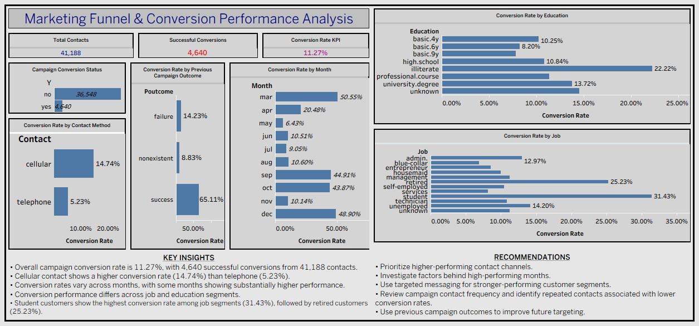

# Marketing Funnel & Conversion Performance Analysis

## 📌 Project Overview

This project analyzes a bank marketing campaign dataset to understand campaign conversion performance and identify patterns across different customer segments, contact methods, months, education levels, job categories, and previous campaign outcomes.

This project was completed as part of the **Future Interns Data Science & Analytics Internship – Task 3**.

## 🎯 Objective

The main objectives of this project are:

- Analyze overall marketing campaign conversion performance
- Identify successful and unsuccessful campaign outcomes
- Compare conversion rates across different contact methods
- Analyze conversion performance across different months
- Compare customer segments such as job and education
- Analyze previous campaign outcomes and their relationship with current conversion
- Identify key drop-off areas
- Provide actionable recommendations for improving campaign performance

## 📊 Dataset

**Dataset:** UCI Bank Marketing Dataset

The dataset contains information about customers contacted during a bank marketing campaign.

### Target Variable

- `Y = yes` → Customer subscribed to a term deposit
- `Y = no` → Customer did not subscribe

### Funnel Definition

The original dataset does not contain separate **Visitors → Leads → Customers** stages.

Therefore, this project defines the marketing funnel as:

**Campaign Contacts → Successful Conversions**

This approach avoids creating or assuming visitor and lead numbers that are not present in the original dataset.

## 🛠️ Tools Used

- **Microsoft Excel** – Data cleaning and preparation
- **Tableau** – Data analysis and dashboard creation
- **GitHub** – Project documentation and submission

## 📈 Key KPIs

| KPI | Value |
|---|---:|
| Total Contacts | 41,188 |
| Successful Conversions | 4,640 |
| Overall Conversion Rate | 11.27% |

## 🔍 Key Insights

1. The overall campaign conversion rate was **11.27%**, with 4,640 successful conversions from 41,188 contacts.

2. The **cellular contact method** had a higher observed conversion rate of **14.74%**, compared with **5.23%** for telephone contacts.

3. Conversion rates varied considerably across different months, indicating differences in observed campaign performance over time.

4. Customers with a **successful previous campaign outcome** had an observed conversion rate of **65.11%** in the current campaign.

5. Among job segments, **students** had the highest observed conversion rate at **31.43%**, followed by **retired customers at 25.23%**.

## 💡 Recommendations

- Prioritize contact methods associated with higher observed conversion rates.
- Investigate the factors behind higher-performing months and identify practices that can be tested in future campaigns.
- Use customer segment information to develop more targeted marketing messages.
- Review repeated campaign contacts and identify patterns associated with lower conversion rates.
- Use previous campaign outcomes as an input for future customer targeting and campaign planning.

## 📊 Dashboard

### Marketing Funnel & Conversion Performance Dashboard

The Tableau dashboard includes:

- Campaign Conversion Status
- Total Contacts
- Successful Conversions
- Overall Conversion Rate
- Conversion Rate by Contact Method
- Conversion Rate by Month
- Conversion Rate by Job
- Conversion Rate by Education
- Conversion Rate by Previous Campaign Outcome

## 📁 Project Files

- `README.md` – Project documentation
- `Bank_Marketing_Campaign_Cleaned.xlsx` – Cleaned dataset
- `FUTURE_DS_03_Marketing_Funnel_Conversion_Analysis.twbx` – Tableau workbook
- `Marketing_Funnel_Conversion_Dashboard.png` – Final dashboard image

## 👩‍💻 Internship

**Future Interns – Data Science & Analytics Internship**

**Task 3: Marketing Funnel & Conversion Performance Analysis**

### Project Workflow

**Data Cleaning → Data Analysis → Conversion Analysis → Tableau Dashboard → Business Insights & Recommendations**
